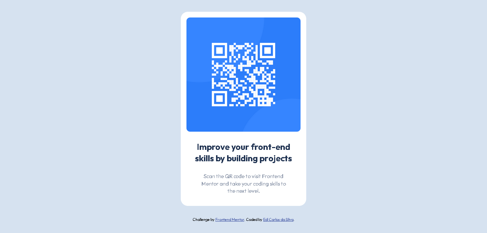

<h1 align="center"> Frontend Mentor - QR code component solution</h1>

This is a solution to the [QR code component challenge on Frontend Mentor](https://www.frontendmentor.io/challenges/qr-code-component-iux_sIO_H).

## Table of contentsf

  - [Links](#links)
  - [Built with](#built-with)
  - [Author](#author)
  - [Acknowledgments](#acknowledgments)

### Links

- Solution URL: [github repository](https://github.com/ediCarlosSilva/qr-code-component)
- Live Site URL: [Deploy in vercel](https://qr-code-component-4te3i1o6s-edicarlossilva.vercel.app/)

### Built with

- Semantic HTML5 markup
- CSS custom properties
- Flexbox
- Mobile-first workflow

## Author

- Website - [Edi Carlos da Silva](https://edicarlossilva.github.io/)
- Frontend Mentor - [@ediCarlosSilva](https://www.frontendmentor.io/profile/ediCarlosSilva)
- LinkedIn - [@edicarlossilva](https://www.linkedin.com/in/edicarlossilva/)

## Acknowledgments

I thank Hugo Lopes. He's not a front-end developer, but he's the first person in the development world who looked at me. A person who has helped me with my silliest questions anyone can have (and he has always responded politely and kindly). Our lives intersected at some point for a professional reason. It does not matter. He has been a true mentor and friend to me.